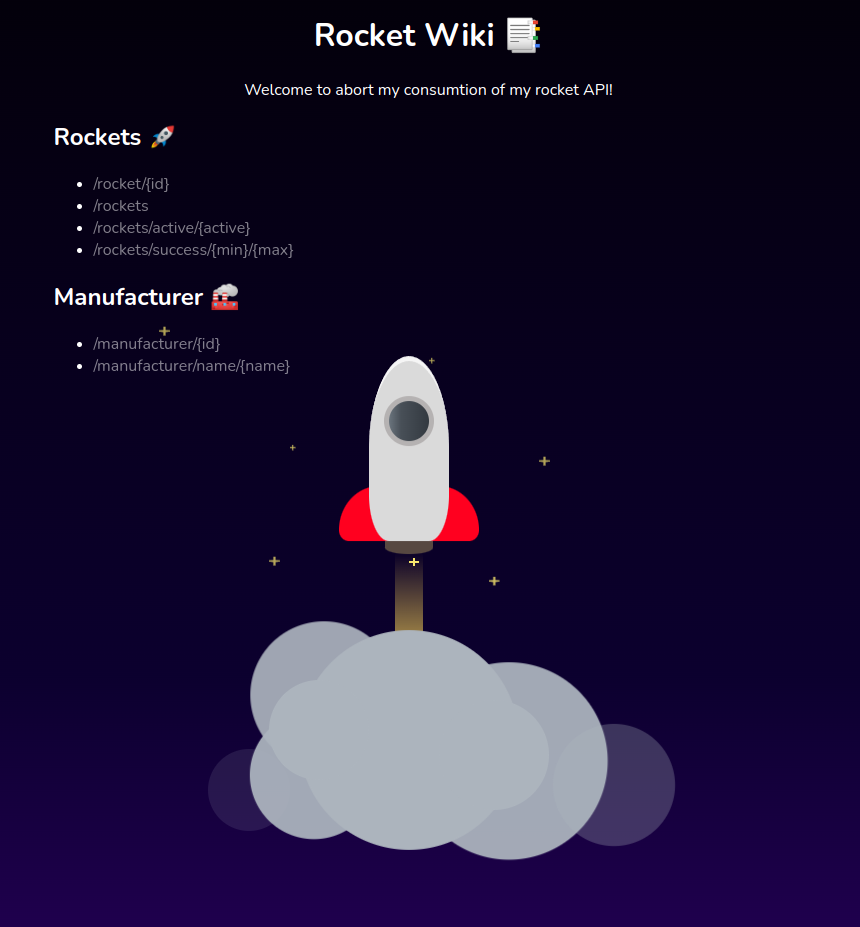

# Rocket Wiki API & consumption  
  
  
## Launch Rocket Wiki  
Run `./launch_rocketwiki.sh` and after about 5 seconds run `./setup_db.sh`  

## Consumption
The consumption of the wiki is located at `127.0.0.1:8000`  

phpMyAdmin is located at: `127.0.0.1:8081`  

## Demo

## Technologies  
- Laravel  
- MySQL  
- REST  
- HTML/CSS
- Docker